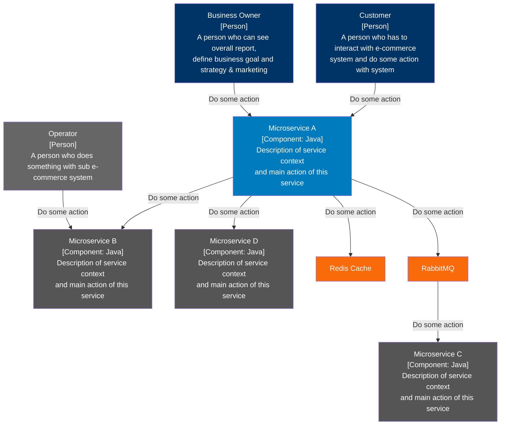

สวัสดีครับทุกคน วันนี้ชายจะมาแนะนำ tip & trick ในการใช้ AI เพื่อเพิ่ม productivity ของเราในการทำงานกันครับ ในทำงานเป็น Software Engineer งานหลักของเราก็คือการทำความเข้าใจระบบ ออกแบบและแก้ปัญหา เขียนโค้ด และสุดท้ายก็คือการจัดการกับความรู้ที่มีให้เป็นระบบ ลองนึกภาพตัวเราเข้าไปทำงานในบริษัทที่มีระบบขนาดใหญ่และต้องเรียนรู้มันแบบไม่มีเอกสารดูสิครับ ถึงต่อให้มีเอกสารแต่มีแค่ข้อความก็ไม่ง่ายแน่ๆ รับรองความท้อแท้บังเกิด ทีนี้สิ่งที่ช่วยให้เห็นภาพง่ายที่สุดก็คือ diagram นั้นเองครับ

## Pain Point ของ Diagram

ตอนที่ผมจะสร้าง diagram ผมได้ใช้ online tools ที่ชื่อว่า Miro ในการสร้าง แต่ diagram เองก็มีเรื่องที่ต้องจัดการเพิ่มขึ้นเมื่อเรามี diagram หลายๆเวอร์ชั่น ซึ่งนั่นคือข้อจำกัดของ Miro จากประสบการณ์ผมจะมีข้อจำกัดหลักๆคือ

1. ไม่สามารถทำ diagram เวอร์ชั่นได้
2. ถ้า copy & paste ก็บอร์ดก็จะใหญ่ขึ้นเรื่อยๆ
3. ถ้าไม่มีการลบออกบ้าง บอร์ดจะหาจุดเริ่มและจุดจบไม่ถูก สุดท้ายงง

> จริงๆในบอร์ดควรจะมีแต่ component จำเป็น แต่ system ที่ใหญ่มากๆบางครั้งการรวมอยู่ในบอร์ดเดียวกันก็เข้าใจง่ายกว่า ซึ่งถ้ามีหลาย version อีกก็จะยิ่งง่ายต่อการสับสนมากขึ้นไปอีก

ทีนี้ผมเห็นว่า Miro นั้นสามารถ export diagram ออกมาเป็นรูปได้ ผมก็เลยปิ้ง idea ว่างั้นถ้าเราลองให้ AI ช่วยแปลงรูป diagram ไปเป็น mermaid/PlantUML โค้ดล่ะจะเป็นไปได้ไหม ก็เลยเกิดการทดลองนี้ขึ้น

## ทดลองความสามารถของ AI

ทุกวันนี้ AI ฉลาดขึ้นมาก โดยผมจะใช้ AI หลักๆอยู่ 2 ตัว

1. `ChatGPT` - Deep research เป็น feature ที่ถูกใจคนชอบอ่าน ชอบหาข้อมูลแน่นอน
2. `Claude` - Coding เป็น AI ที่ขยัน, เข้าใจบริบท, ความสามารถเวอร์มากเมื่อใช้กับ Cursor IDE

โดยวันนี้ผมจะแปลงรูป diagram เป็นโค้ดแล้วนำไปทำเวอร์ชั่นด้วย markdown และเก็บไว้ที่ Git

เริ่มจากภาพแรกนี้ ผมสร้าง C4 Diagram ขึ้นมาแบบง่ายๆ เพื่อให้เห็น High-level design ของระบบง่ายๆ

นี่คือผลลัพธ์ที่ได้จาก AI (ChatGPT ผลลัพธ์แรกจะยังไม่ถูกเป๊ะๆ เราต้อง prompt ให้มันแก้จนกว่าจะถูก ซึ่งผมใช้ไม่ถึง 5 นาทีก็ได้เลย)

## สรุปความสามารถของ AI

<compore ระหว่างใช้และไม่ใช้ ข้อดี ข้อเสีย รวมถึง tip & trick ที่ช่วยเพิ่ม productive>
